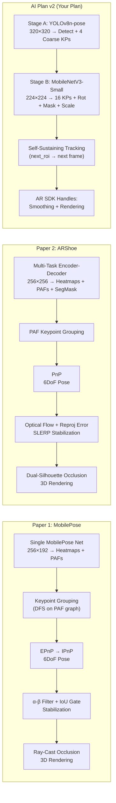
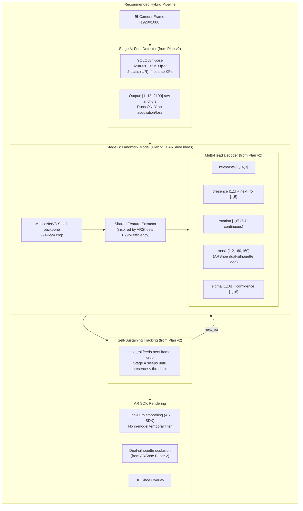

# 🔬 Paper Comparison & Optimal Pipeline Recommendation

**Comparing:** Paper 1 (MobilePose) vs Paper 2 (ARShoe) vs AI_IMPLEMENTATION_PLAN_v2.md

---

## 1. High-Level Architecture Comparison

---

## 2. Core Metrics Comparison Table

| Criterion | Paper 1: MobilePose | Paper 2: ARShoe | AI Plan v2 (Your Plan) |
|:---|:---|:---|:---|
| **Architecture** | Single bottom-up network | Single multi-task encoder-decoder | Two-stage: top-down detector → landmark |
| **Backbone** | MobileNetV2 | Custom Fast-SCNN-inspired | YOLOv8n (Stage A) + MobileNetV3-Small (Stage B) |
| **Input Size** | 256×192 | 256×256 | 320×320 (A) + 224×224 (B) |
| **Keypoints** | **18** (9/foot) | **8** (per foot) | **16** (per foot) + 4 coarse (Stage A) |
| **Left/Right Detection** | PAF graph grouping | PAF graph grouping | **Explicit 2-class head** (left=0, right=1) |
| **Segmentation** | ❌ None | ✅ 2-ch (leg + foot), 64×64 | ✅ 2-ch (foot/shoe + occluder), 160×160 |
| **Rotation Output** | Euler angles via PnP | Euler angles via PnP | **6-D continuous rotation** (direct head) |
| **Stabilization** | α-β filter + IoU freeze | Optical flow + reproj error SLERP | **Delegated to AR SDK** (One-Euro) |
| **Occlusion Handling** | Ray-casting on 3D foot mesh | Dual-silhouette intersection | Segmentation mask handoff to AR SDK |
| **Parameters** | 5.53M (full) / 2.80M (lite) | **1.292M** | ~1.1M (A) + ~3.5M (B) ≈ **4.6M total** |
| **FLOPs** | 1.426G (full) / 0.796G (lite) | **0.984G** | ~1.5G (A once) + ~0.3G (B/frame) |
| **Size (fp32)** | ~22 MB | ~5 MB | **≤5 MB** (A) + **≤14 MB** (B) |
| **Runtime Target** | TFLite (mobile native) | CoreML / native mobile | **ONNX opset 12** (browser WebGPU/WASM) |
| **Dataset Size** | 6,655 images (→33K aug) | 86K images (→3M aug) | collection new data |
| **Subjects** | 22 | Not specified | 10 |

---

## 3. Speed & Latency Comparison

| Device / Metric | Paper 1: MobilePose | Paper 2: ARShoe | AI Plan v2 Target |
|:---|:---|:---|:---|
| **GPU Latency** | 17.16 ms (GTX 1080) | **11.84 ms** (GPU) | — |
| **CPU Latency** | 34.49 ms (i5-8500) | **59.92 ms** (Xeon E5) | — |
| **iPhone 11 FPS** | ~30 FPS | **58.4 FPS** | — |
| **WASM Budget** | N/A | N/A | **≤12 ms** (A) + **≤7 ms** (B) |
| **iPhone 8/OnePlus** | — | 34–37 FPS | — |
| **TFLite 3-thread** | **7.88 ms** (lite model) | — | — |

> [!IMPORTANT]
> **ARShoe (Paper 2) is nearly 2× faster** than MobilePose (Paper 1) on the same iPhone 11, primarily because:
> 1. It has **4.3× fewer parameters** (1.29M vs 5.53M).
> 2. It runs all three tasks (keypoints + PAFs + segmentation) in a **single shared backbone** with only 0.984 GFLOPs.
> 3. It uses **pipeline parallelism** (3 concurrent threads: network / pose / render).

---

## 4. Accuracy Comparison

### Keypoint Localization (mAP @ OKS)

| Model | mAP | AP₅₀ | AP₇₅ | AP₉₀ |
|:---|:---|:---|:---|:---|
| Paper 1: MobilePose (full) | 0.708 | 0.866 | 0.780 | 0.603 |
| Paper 1: MobilePose No3 (lite) | 0.703 | 0.866 | 0.781 | 0.502 |
| Paper 2: ARShoe | **0.776** | **0.972** | **0.855** | 0.490 |
| **AI Plan v2 Target** | **mAP@50 ≥ 0.80** | — | — | — |
| | **mAP@50-95 ≥ 0.62** | | | |

### 6DoF Pose Accuracy

| Metric | Paper 1 | Paper 2 | AI Plan v2 Target |
|:---|:---|:---|:---|
| Rotation Error (mean/median) | Not reported explicitly | **6.625°** (mean Euler) | **≤6° median geodesic** |
| Translation Error | Not reported | **3.84 mm** | — |

### Segmentation

| Metric | Paper 1 | Paper 2 | AI Plan v2 Target |
|:---|:---|:---|:---|
| Mask IoU | N/A | **0.901** | **≥0.90** |
| Mask AP | N/A | **0.927** | — |
| Boundary IoU@3px | N/A | N/A | **≥0.75** |

---

## 5. Strengths & Weaknesses Summary

### Paper 1: MobilePose — Best For: Pose Accuracy Under Constraints
| ✅ Strengths | ❌ Weaknesses |
|:---|:---|
| Most anatomically detailed KPs (9/foot) | Only 22 subjects — severe overfitting risk |
| Iterative PAF refinement (3 stages) | No segmentation head at all |
| IoU freeze gate eliminates stationary jitter | Euler angles via PnP (gimbal lock risk) |
| TFLite optimized (7.88 ms mobile CPU) | Bottom-up: struggles with overlapping feet |
| EPnP→IPnP gives precise 6DoF | Single model does detection + pose (fragile) |

### Paper 2: ARShoe — Best For: Speed + Multi-Task Efficiency
| ✅ Strengths | ❌ Weaknesses |
|:---|:---|
| **Ultra-lightweight** (1.29M params, 0.98G FLOPs) | Only 8 KPs per foot (coarse anatomy) |
| **58 FPS on iPhone 11** | Assumes constant depth between frames |
| Integrated segmentation (leg + foot) | Single rigid 3D foot model for all users |
| Optical flow stabilization is more robust | 86K dataset not publicly available |
| Pipeline parallelism (3 threads) | No uncertainty/confidence output |
| Dual-silhouette occlusion is elegant | PAF grouping can fail under heavy crossing |

### AI Plan v2 — Best For: Production-Grade Browser AR SDK
| ✅ Strengths | ❌ Weaknesses |
|:---|:---|
| **16 detailed anatomical keypoints** | Requires 15K+ manually annotated frames |
| **Two-stage decoupled pipeline** (robust) | Total model size up to 19 MB (fp32) |
| Self-sustaining tracking via `next_roi` | More complex to implement (9 output heads) |
| Explicit left/right class (no PAF needed) | Browser WASM latency harder to optimize |
| Per-KP uncertainty + confidence heads | No native 3D rendering (delegates to AR SDK) |
| Direct 6-D rotation (no PnP, no gimbal lock) | Needs 3 data stages (public + synthetic + real) |
| 2-ch mask at 160×160 (high-res occlusion) | — |

---

## 6. Critical Design Decision Comparison

### Left/Right Foot Disambiguation
| Approach | Paper 1 & 2 | AI Plan v2 |
|:---|:---|:---|
| **Method** | Bottom-up PAF grouping | **Top-down 2-class detector** |
| **Robustness** | Fails when feet overlap heavily | Robust: class is per-detection |
| **Flip Rate** | Not measured | **Hard gate: ≤1 per 500 frames** |

> [!CAUTION]
> Both papers use **bottom-up PAF association** for left/right disambiguation. This is the **single biggest weakness** for a production VTO system — a class flip swaps both shoes on screen. Your Plan v2's explicit 2-class detector with the hard flip-rate gate is the **correct production choice**.

### Rotation Representation
| Approach | Paper 1 & 2 | AI Plan v2 |
|:---|:---|:---|
| **Method** | PnP → Euler angles | **Direct 6-D continuous rotation head** |
| **Pros** | Classical, well-understood | No gimbal lock, smooth interpolation |
| **Cons** | Gimbal lock, PnP noise, needs post-filter | Needs GT rotation supervision |

### Temporal Stability
| Approach | Paper 1 | Paper 2 | AI Plan v2 |
|:---|:---|:---|:---|
| **Method** | α-β filter + IoU freeze | Optical flow + SLERP | **Delegates to AR SDK One-Euro** |
| **Verdict** | Effective but hacky | More principled but assumes constant depth | Clean separation of concerns |

---

## 7. Verdict: Which Paper Is More Efficient to Implement?

### 🏆 Paper 2 (ARShoe) wins on implementation efficiency:

| Factor | Winner | Why |
|:---|:---|:---|
| **Fewer Parameters** | ARShoe (1.29M) | 4.3× lighter than MobilePose |
| **Higher Mobile FPS** | ARShoe (58 FPS) | 2× faster than MobilePose on iPhone 11 |
| **Built-in Segmentation** | ARShoe | MobilePose has none |
| **Simpler Architecture** | ARShoe | Single encoder + 3 parallel decoders |
| **Training Data** | ARShoe (86K) | MobilePose only has 6.6K base images |
| **Occlusion Quality** | ARShoe | Dual-silhouette > ray-casting for shoe VTO |

### But AI Plan v2 is the production-correct approach because:
1. **Top-down 2-class detection** eliminates the PAF left/right flip catastrophe.
2. **Self-sustaining tracking** (`next_roi`) means the detector runs rarely → massive FPS savings.
3. **16 anatomical keypoints** enable precise shoe alignment that 8 KPs cannot achieve.
4. **Direct rotation head** avoids PnP noise + gimbal lock.
5. **Browser-first (ONNX/WASM)** is a fundamentally different deployment target.

---

## 8. 🚀 Recommended Optimal Pipeline

The best pipeline **borrows the strongest ideas from each approach** and integrates them into the Plan v2 architecture:

### What to borrow from each source:

| Component | Take From | Rationale |
|:---|:---|:---|
| **Two-stage detection → landmark** | **Plan v2** ✅ | Eliminates PAF left/right flip risk |
| **Self-sustaining tracking (next_roi)** | **Plan v2** ✅ | Detector runs rarely → huge FPS gain |
| **Lightweight backbone design** | **ARShoe** + Plan v2 | ARShoe proved 1.29M params is viable; MobileNetV3-Small achieves similar efficiency |
| **Pixel Shuffle upsampling** | **Both papers** ✅ | Both papers confirm PixelShuffle >> bilinear for sharpness and speed |
| **Multi-task shared backbone** | **ARShoe** ✅ | KP + Mask from single backbone is proven efficient |
| **6-D continuous rotation (direct)** | **Plan v2** ✅ | Avoids PnP noise + Euler gimbal lock |
| **Dual-silhouette occlusion** | **ARShoe** ✅ | Elegant shoe-mouth occlusion without full ray-casting |
| **Per-KP uncertainty (σ, confidence)** | **Plan v2** ✅ | Neither paper has this — critical for production confidence |
| **IoU stationary freeze (optional)** | **MobilePose** | Simple heuristic to add to AR SDK's One-Euro filter |
| **16 anatomical keypoints** | **Plan v2** ✅ | 8 KPs (ARShoe) is too coarse for precise shoe fitting |
| **Explicit left/right class head** | **Plan v2** ✅ | Hard gate ≤1 flip/500 frames is non-negotiable |

---

## 9. Recommended Implementation Order (Fastest Path to Working Demo)

| Phase | What | Time Estimate | Why This Order |
|:---|:---|:---|:---|
| **Phase 1** | Stage A detector (YOLOv8n-pose, 2-class, 4 coarse KPs) | 1–2 weeks | Can demo foot detection immediately |
| **Phase 2** | Stage B landmark head only (16 KPs + presence + next_roi) | 2–3 weeks | Core tracking loop works end-to-end |
| **Phase 3** | Add rotation head (6-D continuous) | 1 week | Enables 3D shoe placement |
| **Phase 4** | Add segmentation mask (2-ch, 160×160) | 1–2 weeks | Enables occlusion handling |
| **Phase 5** | Add uncertainty heads (σ, confidence, scale) | 1 week | Production polish |
| **Phase 6** | ONNX export + browser integration | 1 week | Deployment |

> [!TIP]
> **Fastest path to a visible demo:** Complete Phases 1–3 first (4–6 weeks). This gives you foot detection + 16 KPs + 6DoF rotation = a working shoe overlay. Segmentation and uncertainty are polish layers that can follow.

---

## 10. Final Recommendation

> [!IMPORTANT]
> **Your AI Plan v2 is already the strongest architecture.** It correctly avoids the two fatal flaws of both papers:
> 1. ❌ Bottom-up PAF left/right disambiguation (class flip catastrophe)
> 2. ❌ PnP + Euler angles (gimbal lock + noise)
>
> **Borrow from ARShoe:** its Pixel Shuffle upsampling, pipeline parallelism philosophy, and dual-silhouette occlusion concept.
> **Borrow from MobilePose:** its IoU stationary freeze heuristic (add to AR SDK side).
> **Keep from Plan v2:** Everything else — the two-stage architecture, 16 KPs, 6-D rotation, self-sustaining tracking, per-KP uncertainty, ONNX/WASM browser target, and the hard left/right flip gate.
